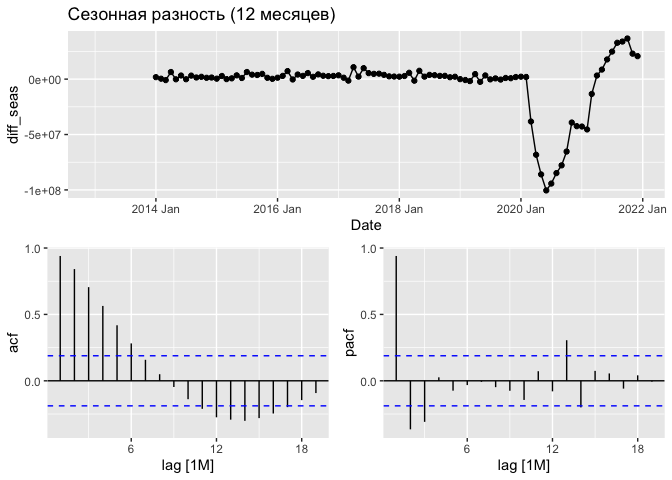
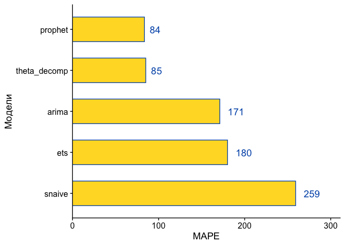

## 1 Импорт

*Возьмите любой ряд с ежемесячными наблюдениями.*

Ряд - количество ночей проведенных туристами (резидентами и не резидентами) в гостиницах. Данные аггрегированы по всему Евросоюзу. Данные взяты с сайта [eurostat](https://appsso.eurostat.ec.europa.eu/nui/show.do?dataset=tour_occ_nim&lang=en), сам ряд можно скачать с [github](https://github.com/vearlen/TS1_project_2022-03/blob/main/Data/tour_occ_nim_1_Data.csv). 


```r
# nights spend in hotels --------------------------------------------------
# https://appsso.eurostat.ec.europa.eu/nui/show.do?dataset=tour_occ_nim&lang=en
df2 = read.csv("Data/tour_occ_nim_1_Data.csv")

# unique(df2$NACE_R2)

df2_ts = df2 %>% 
  filter(GEO == "European Union - 27 countries (from 2020)",
         UNIT == "Number",
         C_RESID == 'Foreign country',
         UNIT == "Number",
         NACE_R2 == "Hotels and similar accommodation",
         Value != ":") %>% 
  # mutate(GEO = "EU") %>% 
  select(TIME,Value) %>%
  mutate(Value = gsub(" ","",Value)) %>% 
  mutate(Value = as.numeric(Value)) %>% 
  mutate( Date = str_replace(TIME,"M","-")) %>% 
  mutate(Date = yearmonth(Date)) %>% 
  tsibble(index=Date)  %>% 
  select(Value,Date)


# unemployment ratio ------------------------------------------------------
# https://appsso.eurostat.ec.europa.eu/nui/show.do?dataset=une_rt_m&lang=en

df3 = read.csv("Data/ei_lmhr_m_1_Data.csv")

df3_ts = df3 %>% 
  filter(INDIC == "Unemployment according to ILO definition - Total",
         S_ADJ == "Unadjusted data (i.e. neither seasonally adjusted nor calendar adjusted data)",
         Value != ":") %>% 
  select(TIME,Value) %>%
  # mutate(Value = gsub(" ","",Value)) %>% 
  mutate(Value = as.numeric(Value)) %>% 
  mutate( Date = str_replace(TIME,"M","-")) %>% 
  mutate(Date = yearmonth(Date)) %>% 
  tsibble(index=Date)  %>% 
  select(Value,Date)
```

## 2 Визуализация

*Визуализируйте сам ряд, ряд обычных и сезонных разностей, компоненты ряда, обычные и частные автокорреляционные функции.*\
Сам ряд.


```r
ggplot(df2_ts,aes(x=Date,y=Value))+
  geom_line(color='grey30',lty=1,size=0.4)+
  # geom_line(data=df2_ts,aes(x=Date,y=Value/1e+7),color='#0066cc',size=0.4)+
  theme_cowplot()+
  background_grid(size.major = 0.2)+
  scale_x_yearmonth(date_breaks = "6 month", date_labels = "%y'%m")+
  labs(title = "Кол-во ночей в гостинице", 
       x="",y="")+
  theme(plot.title = element_text(color='black'),
    plot.subtitle = element_text(color='grey30'),
    axis.text.x = element_text(color='grey30',size=10,angle=90),
    axis.text.y = element_text(color='grey30',size=10),
    axis.title.y = element_text(size=13))
```

<!-- -->

  
На графике ряда видна явно выраженная сезонность. График ACF также имеет сезонные всплески. Кроме того, всплески в ACF (при низких лагах) с сужающимся PACF указывают на несезонные компоненты MA. Всплески в PACF (при низких лагах) с сужающимся ACF указывают на возможные несезонные компоненты AR.  
  


```r
gg_tsdisplay(df2_ts,plot_type = 'partial')+
  labs(title = "Ночи проведенные в гостиницах")
```

<!-- -->

STL разложение.


```r
stl_model = model(df2_ts,
                  decomp = STL(Value ~ trend(window = 30) +
                                 season(window = 50)))
components(stl_model) %>% autoplot()
```

<!-- -->

Визуализируем ряд в первых разностях, так он даже выглядит практически стационарным, хоть и очень сезонным.  


```r
nights = df2_ts %>% 
  rename('N_nights'='Value')
nights = mutate(nights, diff = difference(N_nights, order_by = Date))
gg_tsdisplay(nights, y = diff, plot_type = 'partial')+
  labs(title="Разность ряда")
```

<!-- -->

Визуализируем ряд в сезонных разностях. Очевидно что ковидный период подпортил статистику. Разница не выглядит стационарной.


```r
nights = mutate(nights, diff_seas = difference(N_nights, lag = 12, order_by = Date))
gg_tsdisplay(nights, y = diff_seas, plot_type = 'partial')+
  labs(title="Сезонная разность (12 месяцев)")
```

<!-- -->

Если отрезать ковидный период, то разница уже больше похожа на стационарный ряд. ARIMA (p,1,q)?


```r
nights = mutate(nights, diff_seas = difference(N_nights, lag = 12, order_by = Date))
nights_cut = filter(nights, Date < ymd("2020-03-01"))
gg_tsdisplay(nights_cut, y = diff_seas, plot_type = 'partial')+
  labs(title="Сезонная разность (12 мес) без последних двух лет")
```

<!-- -->

## 3 Стационарность

*Является ли ряд стационарным?*

### ADF с константой  

Применим ADF с константой ( так как мы не наблюдаем квадратичного тренда в нашем ряду не нужен ADF с трендом, а так как мы уверены что матожидание не нулевое, не нужен ADF без константы)  
  

```r
#3. ADF с константой
# H0: ts = ARIMA(p, 1, q) + trend (нестационарный ряд)
# Ha: ts = ARIMA(p, 0, q) + const (стационарный ряд)
summary(ur.df(nights$N_nights, type = 'drift',
                selectlags = 'AIC'))# H0 отвергается на 5% уровне значимости
```

```
## 
## ############################################### 
## # Augmented Dickey-Fuller Test Unit Root Test # 
## ############################################### 
## 
## Test regression drift 
## 
## 
## Call:
## lm(formula = z.diff ~ z.lag.1 + 1 + z.diff.lag)
## 
## Residuals:
##       Min        1Q    Median        3Q       Max 
## -35494483  -6649223  -1564895   6600159  24814553 
## 
## Coefficients:
##               Estimate Std. Error t value Pr(>|t|)    
## (Intercept)  1.257e+07  2.472e+06   5.085 1.65e-06 ***
## z.lag.1     -2.045e-01  3.529e-02  -5.795 7.52e-08 ***
## z.diff.lag   6.922e-01  7.146e-02   9.687 3.67e-16 ***
## ---
## Signif. codes:  0 '***' 0.001 '**' 0.01 '*' 0.05 '.' 0.1 ' ' 1
## 
## Residual standard error: 11940000 on 103 degrees of freedom
## Multiple R-squared:  0.5071,	Adjusted R-squared:  0.4975 
## F-statistic: 52.97 on 2 and 103 DF,  p-value: < 2.2e-16
## 
## 
## Value of test-statistic is: -5.7947 16.7916 
## 
## Critical values for test statistics: 
##       1pct  5pct 10pct
## tau2 -3.46 -2.88 -2.57
## phi1  6.52  4.63  3.81
```

```r
                                    # H0 отвергается на 1% уровне значимости
                                    # первое наблюдаемое значение -3.0 как в лекциях
                                    # сравниваем с первой строкой tau2
```

Наблюдаемое значение -5.79, критическое -2.88 (на 5% уровне значимости). Наблюдаемое меньше, т.е. Н0 отвергается - ряд стационарный.

### KPSS c константой  
  
В ряду нет явного тренда, поэтому применим KPSS с константой  


```r
# KPSS с константой
# H0: ts = mu + stat (стационарный ряд)
# Ha: ts = mu + stat + rw (нестационарный ряд)
summary(ur.kpss(nights$N_nights, type = 'mu'))  # H0 не отвергается на 5% уровне значимости
```

```
## 
## ####################### 
## # KPSS Unit Root Test # 
## ####################### 
## 
## Test is of type: mu with 4 lags. 
## 
## Value of test-statistic is: 0.4021 
## 
## Critical value for a significance level of: 
##                 10pct  5pct 2.5pct  1pct
## critical values 0.347 0.463  0.574 0.739
```

```r
                                                # наблюдаемое меньше чем критическое
```

Получается что наблюдаемое значение статистики меньше чем критическое (на 5% уровне), т.е. Н0 не отвергается, значит ряд стационарный.

## 4 Преобразование

*Если разумно применить к исходному ряду какое-либо преобразование, то примените его, мотивировав свой выбор.*

Поскольку тест показывает что ряд у нас стационарный и в целом, за исключением последних пары лет (Covid-19), и выглядит он стационарным, никаких преобразований мы решили не делать, по крайней мере на этом этапе.  

## 5 Деление

*Поделите ряд на тестовую и обучающую выборку.*


```r
df_all = left_join(nights,df3_ts)
df_all = rename(df_all,'unempl'='Value')
df_all = mutate(df_all, diff_unempl = difference(unempl,1),
                sdiff_unempl = difference(unempl,12))

# считаем макс мин для масштабирования
min_nights = min(df_all$diff_seas,na.rm = TRUE)
max_nights = max(df_all$diff_seas,na.rm = TRUE)
min_unmp = min(df_all$sdiff_unempl,na.rm = TRUE)
max_unmp = max(df_all$sdiff_unempl,na.rm = TRUE)

# масштабируем
df_all_sc = df_all %>% 
  mutate (nights_sdif_sc = (diff_seas-min_nights)/(max_nights-min_nights),
          unempl_sdif_sc = (sdiff_unempl-min_unmp)/(max_unmp-min_unmp))

# делим на тестовую и обучающую
df_train <- filter(df_all_sc, Date < ymd ('2021-01-01'))
df_test <- filter(df_all_sc, Date >= ymd ('2021-01-01'))
```

## 6 Модели

*Оцените ряд моделей/алгоритмов на тестовой выборке.*  

Оцениваем ряд моделей: сезонную наивную модель, ARIMA с автоматическим выбором количества лагов в AR и MA части и выбором порядка интегрированности, ETS модель, а также реализуем алгоритмы prophet и тета-метод.  
  

```r
fit_models <- df_train %>% 
  model(
    snaive = SNAIVE(N_nights),
    arima = ARIMA(N_nights),
    ets = ETS(N_nights),
    prophet = prophet(N_nights ~ season ('year', 10, type='additive')),
    theta_decomp = decomposition_model(
                STL(N_nights ~ season(window=Inf)),
                THETA(season_adjust),
                SNAIVE(season_year))
  )
```


```r
fct = forecast(fit_models,new_data=df_test)
```


```r
fct %>% 
  accuracy(df_all) %>% 
  arrange(MAPE) %>% 
  # select(-MASE,-RMSSE) %>% 
  select(-.type) %>% 
  mutate_if(is.numeric,round,2) %>% 
  datatable(rownames = FALSE,options=list(pageLength=9), autoHideNavigation = TRUE)
```

```{=html}
<div id="htmlwidget-f4850d9825957f6e4db8" style="width:100%;height:auto;" class="datatables html-widget"></div>
<script type="application/json" data-for="htmlwidget-f4850d9825957f6e4db8">{"x":{"filter":"none","autoHideNavigation":true,"data":[["prophet","theta_decomp","arima","ets","snaive"],[9557138.9,744794.49,27017217.24,-15793338.43,8331459.67],[22477984.79,16013294.9,29832721.8,22567128.93,28309733.58],[16977922.99,13165861.86,27017217.24,18731603.58,25260921.33],[8.31,-37.67,171.13,-170.02,-157.86],[83.57,85.08,171.13,180.11,259.19],[1.58,1.23,2.52,1.75,2.35],[0.88,0.63,1.17,0.89,1.11],[0.8,0.8,0.69,0.77,0.74]],"container":"<table class=\"display\">\n  <thead>\n    <tr>\n      <th>.model<\/th>\n      <th>ME<\/th>\n      <th>RMSE<\/th>\n      <th>MAE<\/th>\n      <th>MPE<\/th>\n      <th>MAPE<\/th>\n      <th>MASE<\/th>\n      <th>RMSSE<\/th>\n      <th>ACF1<\/th>\n    <\/tr>\n  <\/thead>\n<\/table>","options":{"pageLength":9,"columnDefs":[{"className":"dt-right","targets":[1,2,3,4,5,6,7,8]}],"order":[],"autoWidth":false,"orderClasses":false,"lengthMenu":[9,10,25,50,100]}},"evals":[],"jsHooks":[]}</script>
```

Смотрим на сравнение наших моделей по метрике MAPE. Лучшей моделью по MAPE оказалась модель, построенная по алгоритму prophet.  
  


```r
accuracy(fct,df_all) %>% 
  select(MAPE,.model) %>% 
  ggplot(aes(y=reorder(.model,-MAPE),x=MAPE,label=round(MAPE,0)))+
  geom_col(width = 0.6,alpha=0.9,color='#0057b7',fill='#ffd700')+
  geom_text(size=5,hjust = -0.5,color='#0057b7')+
  theme_cowplot()+
  scale_x_continuous(expand = expansion(mult = c(0,0.2)))+
  labs(y="Модели")
```

<!-- -->

## 7 Победитель

*Выберите наилучшую модель*

Визуализируем результаты прогнозирования тестовой выборки по двум лучшим моделям.
Ради лучшей визуализации начало ряда обрезаем, но только для графика!  


```r
df_all_begin_cut = filter(df_all, Date > ymd("2018-01-01"))

# prophet
plt_prophet = fct %>% 
  filter(.model == "prophet") %>% 
  autoplot(lty=2,fill='#0057b7')+
  autolayer(df_all_begin_cut)+
  theme_cowplot()+
  background_grid(size.major = 0.2)+
  scale_x_yearmonth(date_breaks = "4 month", date_labels = "%y'%m")+
  theme(axis.text.x = element_text(color='grey',size=10,angle=90))+
  labs(title = "PROPHET")

# THETA
plt_theta = fct %>% 
  filter(.model == "theta_decomp") %>% 
  autoplot(lty=2,fill='#dbaf00')+
  autolayer(df_all_begin_cut)+
  theme_cowplot()+
  background_grid(size.major = 0.2)+
  scale_x_yearmonth(date_breaks = "4 month", date_labels = "%y'%m")+
  theme(axis.text.x = element_text(color='grey',size=10,angle=90))+
  labs(title = "THETA")

cowplot::plot_grid(plt_prophet,plt_theta,nrow=2)
```

<!-- -->


## 8 Удивить!  
  
Поскольку ряд по ночам, проведенным туристами в отеле явно поломался в годы пандемии Covid-19, нам показалось интересной идея включить в модели дополнительный предиктор, каким-то образом отражающий влияние пандемии. Мы посчитали, что хорошим возможным предиктором может стать безработица, поскольку она так же имеет сезонный характер и хорошо отражает влияние пандемии. 

Второй ряд, процент безработных среди работающего населения, взят так же с сайта [eurostat](https://appsso.eurostat.ec.europa.eu/nui/show.do?dataset=une_rt_m&lang=en) и,аналогично, можно взять копию [csv](https://github.com/vearlen/TS1_project_2022-03/blob/main/Data/ei_lmhr_m_1_Data.csv) с github. Ряд, аналогично первому, показывает весь Евросоюз.  

Визуализируем два ряда вместе.  
  

```r
ggplot(df3_ts,aes(x=Date,y=Value*10))+
  geom_line(color='grey30',lty=5,size=0.4)+
  geom_line(data=df2_ts,aes(x=Date,y=Value/1e+6),color='#0066cc',size=0.4)+
  theme_cowplot()+
  background_grid(size.major = 0.2)+
  scale_x_yearmonth(date_breaks = "6 month", date_labels = "%y'%m")+
  labs(title = "Кол-во ночей в гостинице", subtitle = "Безработица",
       x="",y="Безработица * 10
ночи в гостинице / 1е+06")+
  theme(plot.title = element_text(color='#0066cc'),
    plot.subtitle = element_text(color='grey30'),
    axis.text.x = element_text(color='grey30',size=10,angle=90),
    axis.text.y = element_text(color='grey30',size=10),
    axis.title.y = element_text(size=13))
```

<!-- -->
  
И с сезонной разницей для ряда безработицы.  


```r
ggplot(df_all,aes(x=Date,y=sdiff_unempl*100))+
  geom_line(color='grey30',lty=5,size=0.4)+
  geom_line(data=df_all,aes(x=Date,y=N_nights/1e+06),color='#0066cc',size=0.4)+
  theme_cowplot()+
  background_grid(size.major = 0.2)+
  scale_x_yearmonth(date_breaks = "6 month", date_labels = "%y'%m")+
  labs(title = "Кол-во ночей в гостинице", subtitle = "Безработица сезонный прирост (х100)",
       x="",y="Безработица прирост * 100
ночи в гостинице / 1е+06")+
  theme(plot.title = element_text(color='#0066cc'),
    plot.subtitle = element_text(color='grey30'),
    axis.text.x = element_text(color='grey30',size=10,angle=90),
    axis.text.y = element_text(color='grey30',size=10),
    axis.title.y = element_text(size=13))
```

<!-- -->
  
Строим модели, включая в качестве дополнительного предиктора обычную безработицу и десезонированную безработицу.  
  

```r
fit_models_sns <- df_train %>% 
  model(
    arima_r = ARIMA(N_nights ~ unempl),
    arima_r_s = ARIMA(N_nights ~ sdiff_unempl),
    arima110_r = ARIMA(N_nights ~ unempl+ pdq(1,1,0)),
    arima110_r_s = ARIMA(N_nights ~ sdiff_unempl+ pdq(1,1,0)),
    sarima111_1xx_r = ARIMA(N_nights ~ unempl + pdq(1, 1, 1) + PDQ(1, 0:1, 0:2)),
    sarima111_1xx_r_s = ARIMA(N_nights ~ sdiff_unempl + pdq(1, 1, 1) + PDQ(1, 0:1, 0:2))
  )
```


```r
fct_sns = forecast(fit_models_sns,df_test)
```


```r
fct_sns %>% 
  accuracy(df_all) %>% 
  arrange(MAPE) %>% 
  # select(-MASE,-RMSSE) %>% 
  select(-.type) %>% 
  mutate_if(is.numeric,round,3) %>% 
  datatable(rownames = FALSE,options=list(pageLength=9), autoHideNavigation = TRUE)
```

```{=html}
<div id="htmlwidget-440fe82ce130952b5805" style="width:100%;height:auto;" class="datatables html-widget"></div>
<script type="application/json" data-for="htmlwidget-440fe82ce130952b5805">{"x":{"filter":"none","autoHideNavigation":true,"data":[["arima110_r","arima_r_s","arima110_r_s","sarima111_1xx_r","sarima111_1xx_r_s","arima_r"],[8816939.288,8615610.869,8615610.869,2099916.026,14477246.754,17681963.075],[16366203.001,15853896.068,15853896.068,14644554.621,19257062.138,23822474.311],[11872146.16,11790690.165,11790690.165,12259733.802,15041963.803,18930739.179],[21.624,32.14,32.14,-33.814,67.952,65.59],[49.049,55.432,55.432,74.484,82.13,97.146],[1.107,1.099,1.099,1.143,1.402,1.765],[0.644,0.624,0.624,0.576,0.758,0.937],[0.79,0.772,0.772,0.794,0.75,0.771]],"container":"<table class=\"display\">\n  <thead>\n    <tr>\n      <th>.model<\/th>\n      <th>ME<\/th>\n      <th>RMSE<\/th>\n      <th>MAE<\/th>\n      <th>MPE<\/th>\n      <th>MAPE<\/th>\n      <th>MASE<\/th>\n      <th>RMSSE<\/th>\n      <th>ACF1<\/th>\n    <\/tr>\n  <\/thead>\n<\/table>","options":{"pageLength":9,"columnDefs":[{"className":"dt-right","targets":[1,2,3,4,5,6,7,8]}],"order":[],"autoWidth":false,"orderClasses":false,"lengthMenu":[9,10,25,50,100]}},"evals":[],"jsHooks":[]}</script>
```
  
Лучшая модель по MAPE - модель с обычной беработицей arima (1,1,0)(0,1,1).


```r
report(fit_models_sns$arima_r_s[[1]]) # авто с десезон безработицей
```

```
## Series: N_nights 
## Model: LM w/ ARIMA(1,1,0)(0,1,1)[12] errors 
## 
## Coefficients:
##          ar1     sma1  sdiff_unempl
##       0.4315  -0.6506      -4365068
## s.e.  0.1114   0.2152       4113844
## 
## sigma^2 estimated as 4.098e+13:  log likelihood=-1221.09
## AIC=2450.18   AICc=2450.69   BIC=2459.85
```

### Средняя модель  
Осредняем лучшие модели, которые отличаются дополнительным рядом, взятым для предсказания. Одна модель опирается на обычную, другая на десезонированную безработицу.  
  


```r
av_model <- fit_models_sns %>% 
  mutate(mean = (arima110_r + arima_r_s)/2)
```


```r
fct_w_av = forecast(av_model,new_data = df_test)
```


```r
fct_w_av %>% 
  accuracy(df_all) %>% 
  arrange(MAPE) %>% 
  select(-.type) %>% 
  mutate_if(is.numeric,round,2) %>% 
  datatable(rownames = FALSE,options=list(pageLength=10), autoHideNavigation = TRUE)
```

```{=html}
<div id="htmlwidget-21389129e54b196771a9" style="width:100%;height:auto;" class="datatables html-widget"></div>
<script type="application/json" data-for="htmlwidget-21389129e54b196771a9">{"x":{"filter":"none","autoHideNavigation":true,"data":[["arima110_r","mean","arima_r_s","arima110_r_s","sarima111_1xx_r","sarima111_1xx_r_s","arima_r"],[8816939.29,8716275.08,8615610.87,8615610.87,2099916.03,14477246.75,17681963.07],[16366203,16090401.27,15853896.07,15853896.07,14644554.62,19257062.14,23822474.31],[11872146.16,11831418.16,11790690.16,11790690.16,12259733.8,15041963.8,18930739.18],[21.62,26.88,32.14,32.14,-33.81,67.95,65.59],[49.05,52.24,55.43,55.43,74.48,82.13,97.15],[1.11,1.1,1.1,1.1,1.14,1.4,1.76],[0.64,0.63,0.62,0.62,0.58,0.76,0.94],[0.79,0.78,0.77,0.77,0.79,0.75,0.77]],"container":"<table class=\"display\">\n  <thead>\n    <tr>\n      <th>.model<\/th>\n      <th>ME<\/th>\n      <th>RMSE<\/th>\n      <th>MAE<\/th>\n      <th>MPE<\/th>\n      <th>MAPE<\/th>\n      <th>MASE<\/th>\n      <th>RMSSE<\/th>\n      <th>ACF1<\/th>\n    <\/tr>\n  <\/thead>\n<\/table>","options":{"pageLength":10,"columnDefs":[{"className":"dt-right","targets":[1,2,3,4,5,6,7,8]}],"order":[],"autoWidth":false,"orderClasses":false}},"evals":[],"jsHooks":[]}</script>
```

Усредненная из лучших модель не переиграла лучшую. Все равно ARIMA c регрессией осталась лучшей.  


```r
accuracy(fct_w_av,df_all) %>% 
  select(MAPE,.model) %>% 
  ggplot(aes(y=reorder(.model,-MAPE),x=MAPE,label=round(MAPE,0)))+
  geom_col(width = 0.6,alpha=0.9,color='#0057b7',fill='#ffd700')+
  geom_text(size=5,hjust = -0.5,color='#0057b7')+
  theme_cowplot()+
  scale_x_continuous(expand = expansion(mult = c(0,0.2)))+
  labs(y="Модели")
```

<!-- -->


```r
res_reg_un <- av_model %>% 
  augment() %>% 
  select(.resid,.model) %>% 
  filter(.model == "arima110_r")

res_prophet <- fit_models %>% 
  augment() %>% 
  select(.resid,.model) %>% 
  filter(.model == "prophet")

resid_all = bind_rows(res_prophet,res_reg_un)
```
    
Посмотрим на остатки обоих лучших моделей. 
  

```r
ggplot(resid_all,aes(x=Date,y=.resid,color=.model))+
  geom_line()+
  scale_color_manual(values = c("#0066cc","#ffcc00"))+
  labs(y="Остатки", title = "Остатки двух лучших моделей",x="",
       color="Модели:")+
  theme_cowplot()+
  background_grid()+
  scale_x_yearmonth(date_breaks = "6 month", date_labels = "%y'%m")+
  theme(plot.title = element_text(color='#0066cc'),
        legend.position = 'bottom',
    plot.subtitle = element_text(color='grey30'),
    axis.text.x = element_text(color='grey30',size=10,angle=90),
    axis.text.y = element_text(color='grey30',size=10),
    axis.title.y = element_text(size=13))
```

<!-- -->

```r
ggplot(resid_all,aes(x=.resid,fill=.model))+
  geom_histogram(alpha=0.7, position = 'dodge',color='#0066cc')+
  scale_fill_manual(values = c("#0066cc","#ffcc00"))+
  labs(y="", title = "Распределение остатков двух лучших моделей",x="",
       fill="Модели:")+
  theme_cowplot()+
  background_grid()+
  theme(plot.title = element_text(color='#0066cc'),
        legend.position = 'top',
    plot.subtitle = element_text(color='grey30'),
    axis.text.x = element_text(color='grey30',size=10,angle=90),
    axis.text.y = element_text(color='grey30',size=10),
    axis.title.y = element_text(size=13))+
  scale_y_continuous(expand = expansion(mult=c(0,0.1)))
```

<!-- -->
  
Остатки ARIMA (110) (001) больше похожи на имеющие постоянную дисперсию и нулевое матожидание, чем у модели профет, т.е. модель ARIMA и тут выглядит лучше.  

Визуализируем две лучших модели.  
  

```r
# ARIMA
plt_arima110_r = fct_w_av %>% 
  filter(.model == "arima110_r") %>% 
  autoplot(lty=2,fill='#dbaf00')+
  autolayer(df_all_begin_cut)+
  theme_cowplot()+
  background_grid(size.major = 0.2)+
  scale_x_yearmonth(date_breaks = "4 month", date_labels = "%y'%m")+
  theme(axis.text.x = element_text(color='grey',size=10,angle=90))+
  labs(title = "ARIMA ~ безработица (110)(011)  ")

cowplot::plot_grid(plt_arima110_r,plt_prophet,nrow=2)
```

<!-- -->
  
Включение безработицы  в качестве предиктора позволило точнее предсказать всплеск туристического спроса на гостиницы.  

### Прогноз в будущее  
  
Построим модель в будущее, переоценим лучшую модель на всей выборке.  


```r
# 
fit_full <- model(df_all,
  ARIMA(N_nights ~ unempl + pdq(1,1,0) + PDQ (0,1,1)))
```
  
Чтобы использовать нашу лучшую модель нам необходимо спрогнозировать безработицу. Переберем несколько моделей.  


```r
fit_models_unemp <- df_train %>% 
  model(
    snaive = SNAIVE(unempl),
    arima = ARIMA(unempl),
    ets = ETS(unempl),
    prophet = prophet(unempl ~ season ('year', 10, type='additive')),
    theta_decomp = decomposition_model(
                STL(unempl ~ season(window=Inf)),
                THETA(season_adjust),
                SNAIVE(season_year))
  )
```

```r
fct_unempl = forecast(fit_models_unemp, new_data=df_test)
```
  
Посмотрим какая модель лучшая по метрике MAPE, для предсказания безработицы.  
  

```r
fct_unempl %>% 
  accuracy(df_all) %>% 
  arrange(MAPE) %>% 
  # select(-MASE,-RMSSE) %>% 
  select(-.type) %>% 
  mutate_if(is.numeric,round,2) %>% 
  datatable(rownames = FALSE,options=list(pageLength=9), autoHideNavigation = TRUE)
```

```{=html}
<div id="htmlwidget-ac04007bbb2c6a0ad791" style="width:100%;height:auto;" class="datatables html-widget"></div>
<script type="application/json" data-for="htmlwidget-ac04007bbb2c6a0ad791">{"x":{"filter":"none","autoHideNavigation":true,"data":[["theta_decomp","ets","prophet","arima","snaive"],[-0.26,-0.36,-0.73,-0.67,-0.21],[0.38,0.58,0.89,0.94,0.89],[0.27,0.42,0.73,0.76,0.86],[-4,-5.62,-10.92,-10.25,-3.87],[4.18,6.32,10.92,11.45,12.35],[0.35,0.53,0.93,0.98,1.1],[0.47,0.71,1.09,1.15,1.1],[0.71,0.73,0.74,0.81,0.82]],"container":"<table class=\"display\">\n  <thead>\n    <tr>\n      <th>.model<\/th>\n      <th>ME<\/th>\n      <th>RMSE<\/th>\n      <th>MAE<\/th>\n      <th>MPE<\/th>\n      <th>MAPE<\/th>\n      <th>MASE<\/th>\n      <th>RMSSE<\/th>\n      <th>ACF1<\/th>\n    <\/tr>\n  <\/thead>\n<\/table>","options":{"pageLength":9,"columnDefs":[{"className":"dt-right","targets":[1,2,3,4,5,6,7,8]}],"order":[],"autoWidth":false,"orderClasses":false,"lengthMenu":[9,10,25,50,100]}},"evals":[],"jsHooks":[]}</script>
```
  
Лучшая модель - THETA. Переоценим модель на всей выборке и сделаем предсказание на два года.    


```r
fit_models_unemp_all <- df_all %>% 
  model(
    theta_decomp = decomposition_model(
                STL(unempl ~ season(window=Inf)),
                THETA(season_adjust),
                SNAIVE(season_year))
  )
unempl_fct = fit_models_unemp_all %>% select(theta_decomp) %>% forecast(h=24)
```
  
Посмотрим как THETA модель прогнозирует безработицу. 
  

```r
unempl_fct %>% 
  autoplot(color="#0066cc",alpha=0.7)+
  autolayer(df_all_begin_cut,.vars = unempl)+
  scale_x_yearmonth(date_breaks = "4 month", date_labels = "%y'%m")+
  theme_cowplot()+
  background_grid()+
   theme(axis.text.x = element_text(color='grey',size=10,angle=90))+
  labs(title="Безработица, предсказание в будущее",
       subtitle = "THETA",y="",x="")
```

<!-- -->

```r
unempl_fin = unempl_fct[,c(2,4)] %>% 
rename('unempl'='.mean')
```


```r
fct_future = fit_full %>% forecast(new_data=unempl_fin)
```
  
И, наконец, предсказание в будущее наших целевых переменных.  
  

```r
fct_future %>% 
  autoplot(color="#0066cc",alpha=0.7, lty=2)+
  autolayer(df_all_begin_cut,.vars = unempl*1e+7,lty=1,color='grey60')+
   autolayer(unempl_fin,.vars = unempl*1e+7,lty=2,color='grey60')+
  autolayer(df_all_begin_cut)+
  scale_x_yearmonth(date_breaks = "4 month", date_labels = "%y'%m")+
  theme_cowplot()+
  background_grid()+
   theme(axis.text.x = element_text(color='grey',size=10,angle=90))+
  labs(title="Предсказание в будущее, ночи в гостиницах",
       subtitle = "ARIMA ~ безработица (110)(011), серая линия - безработица")+
  labs(x="",y="кол-во ночей в гостинице
безработица (*1е+7)")+
  theme(plot.title = element_text(color='#0066cc'),
    plot.subtitle = element_text(color='grey30'),
    axis.text.x = element_text(color='grey30',size=10,angle=90),
    axis.text.y = element_text(color='grey30',size=10),
    axis.title.y = element_text(size=13))
```

<!-- -->

## 9 Случай из жизни  
  
Был у меня опыт, который, отчасти и привел меня к обучению на этой магистратуре. Мне поставили задачу сделать прогноз некоторого финансового параметра компании для моделирования what-if сценариев. Т.е. временной ряд должен был зависеть от нескольких других параметров, по сути тоже временных рядов.    

Ну и тогда я не придумал ничего лучше чем взять линейную регрессию и попробовать предсказать ряд с помощью неё.  

По мере погружения в проблему, я познакомился с книжкой [Rob'a Hyndman'a](https://otexts.com/fpp3/) и стал пробовать какие-то штуки оттуда, не очень понимая что к чему, если честно. Это, в числе прочего, и послужило мотивацией поучиться этому более систематично. 

Что касается трудностей, думаю они были традиционные. Мало данных изначально, плюс я смотрел на ряды в  2018-2020 годы, а 2020 год, по понятным причинам, аномальный. Его очень трудно предсказывать и учитывать. Ну и отсутствие понимания что такое временные ряды и с чем их едят. Тем не менее, модели я построил, но качество не удовлетворило моих "заказчиков", они хотели ошибку в пределах 5%, а у меня в лучшем случае вышло 10%, а в среднем в районе 25%.

Ниже показаны анонимизированные примеры результатов предсказаний моей модели. Для этого я использовал алгоритм TSLM из пакета fable.


```r
work_exmp = read.csv(file="Data/work_export_example.csv")
```


```r
work_exmp_ts = work_exmp %>% 
  mutate(Date = yearmonth(Date)) %>% 
  as_tsibble(index = Date,key = Country)
```

```r
work_exmp_ts %>% 
  select(Date,Y,Fit,Country) %>%
  filter(Country == "B") %>% 
  pivot_wider(id_cols = Date, 
              names_from = Country,
              values_from = c(Y,Fit)) %>% 
  mutate(Date = as.Date(Date)) %>% 
  TSstudio::ts_plot(Ytitle="Y", slider = TRUE) %>% 
  layout(hovermode = "x unified")
```

```{=html}
<div id="htmlwidget-2cb9b86899331c334901" style="width:672px;height:480px;" class="plotly html-widget"></div>
<script type="application/json" data-for="htmlwidget-2cb9b86899331c334901">{"x":{"visdat":{"9f8753849a7":["function () ","plotlyVisDat"]},"cur_data":"9f8753849a7","attrs":{"9f8753849a7":{"alpha_stroke":1,"sizes":[10,100],"spans":[1,20],"x":["2018-01-01","2018-02-01","2018-03-01","2018-04-01","2018-05-01","2018-06-01","2018-07-01","2018-08-01","2018-09-01","2018-10-01","2018-11-01","2018-12-01","2019-01-01","2019-02-01","2019-03-01","2019-04-01","2019-05-01","2019-06-01","2019-07-01","2019-08-01","2019-09-01","2019-10-01","2019-11-01","2019-12-01","2020-01-01","2020-02-01","2020-03-01","2020-04-01","2020-05-01","2020-06-01","2020-07-01","2020-08-01","2020-09-01","2020-10-01","2020-11-01","2020-12-01"],"y":[317.6140373,-20.8701473,141.1897344,113.7179903,176.5226509,167.1374215,244.947092,182.7669453,125.9624283,262.6049319,159.1617596,156.2527461,117.9722788,105.5678582,169.5413375,226.3112988,247.8073373,175.6230591,131.3078268,89.89710541,228.0854765,101.3908422,170.5083848,186.7725512,107.936459,110.9045634,-81.84538729,-118.3941885,-49.38289652,15.89818754,-22.63053764,-9.54513605,7.86906651,7.810650356,44.33946232,132.0008842],"type":"scatter","mode":"lines","name":"Y_B","line":{"dash":null},"inherit":true},"9f8753849a7.1":{"alpha_stroke":1,"sizes":[10,100],"spans":[1,20],"x":["2018-01-01","2018-02-01","2018-03-01","2018-04-01","2018-05-01","2018-06-01","2018-07-01","2018-08-01","2018-09-01","2018-10-01","2018-11-01","2018-12-01","2019-01-01","2019-02-01","2019-03-01","2019-04-01","2019-05-01","2019-06-01","2019-07-01","2019-08-01","2019-09-01","2019-10-01","2019-11-01","2019-12-01","2020-01-01","2020-02-01","2020-03-01","2020-04-01","2020-05-01","2020-06-01","2020-07-01","2020-08-01","2020-09-01","2020-10-01","2020-11-01","2020-12-01"],"y":[315.8558438,-9.658095278,117.4487542,117.999855,160.6735837,155.1423775,217.7663513,188.1440285,164.1382236,247.7688856,173.6162444,164.3855236,130.5416192,141.8066382,176.3421326,189.1351113,231.7287356,185.2965453,133.1723221,105.7556634,198.0345412,98.00670423,145.8823254,226.0034574,147.046708,139.6665207,-53.78457857,-116.6708421,-50.38777792,18.03910877,-24.38565329,-22.14744982,-26.70627925,6.051587315,28.75946488,102.2858941],"type":"scatter","mode":"lines","name":"Fit_B","line":{"dash":null},"inherit":true}},"layout":{"margin":{"b":40,"l":60,"t":25,"r":10},"xaxis":{"domain":[0,1],"automargin":true,"title":"","showgrid":false,"rangeslider":{"type":"date"}},"yaxis":{"domain":[0,1],"automargin":true,"title":"Y","showgrid":false},"title":".","hovermode":"x unified","showlegend":true},"source":"A","config":{"showSendToCloud":false},"data":[{"x":["2018-01-01","2018-02-01","2018-03-01","2018-04-01","2018-05-01","2018-06-01","2018-07-01","2018-08-01","2018-09-01","2018-10-01","2018-11-01","2018-12-01","2019-01-01","2019-02-01","2019-03-01","2019-04-01","2019-05-01","2019-06-01","2019-07-01","2019-08-01","2019-09-01","2019-10-01","2019-11-01","2019-12-01","2020-01-01","2020-02-01","2020-03-01","2020-04-01","2020-05-01","2020-06-01","2020-07-01","2020-08-01","2020-09-01","2020-10-01","2020-11-01","2020-12-01"],"y":[317.6140373,-20.8701473,141.1897344,113.7179903,176.5226509,167.1374215,244.947092,182.7669453,125.9624283,262.6049319,159.1617596,156.2527461,117.9722788,105.5678582,169.5413375,226.3112988,247.8073373,175.6230591,131.3078268,89.89710541,228.0854765,101.3908422,170.5083848,186.7725512,107.936459,110.9045634,-81.84538729,-118.3941885,-49.38289652,15.89818754,-22.63053764,-9.54513605,7.86906651,7.810650356,44.33946232,132.0008842],"type":"scatter","mode":"lines","name":"Y_B","line":{"color":"rgba(31,119,180,1)","dash":[]},"marker":{"color":"rgba(31,119,180,1)","line":{"color":"rgba(31,119,180,1)"}},"error_y":{"color":"rgba(31,119,180,1)"},"error_x":{"color":"rgba(31,119,180,1)"},"xaxis":"x","yaxis":"y","frame":null},{"x":["2018-01-01","2018-02-01","2018-03-01","2018-04-01","2018-05-01","2018-06-01","2018-07-01","2018-08-01","2018-09-01","2018-10-01","2018-11-01","2018-12-01","2019-01-01","2019-02-01","2019-03-01","2019-04-01","2019-05-01","2019-06-01","2019-07-01","2019-08-01","2019-09-01","2019-10-01","2019-11-01","2019-12-01","2020-01-01","2020-02-01","2020-03-01","2020-04-01","2020-05-01","2020-06-01","2020-07-01","2020-08-01","2020-09-01","2020-10-01","2020-11-01","2020-12-01"],"y":[315.8558438,-9.658095278,117.4487542,117.999855,160.6735837,155.1423775,217.7663513,188.1440285,164.1382236,247.7688856,173.6162444,164.3855236,130.5416192,141.8066382,176.3421326,189.1351113,231.7287356,185.2965453,133.1723221,105.7556634,198.0345412,98.00670423,145.8823254,226.0034574,147.046708,139.6665207,-53.78457857,-116.6708421,-50.38777792,18.03910877,-24.38565329,-22.14744982,-26.70627925,6.051587315,28.75946488,102.2858941],"type":"scatter","mode":"lines","name":"Fit_B","line":{"color":"rgba(255,127,14,1)","dash":[]},"marker":{"color":"rgba(255,127,14,1)","line":{"color":"rgba(255,127,14,1)"}},"error_y":{"color":"rgba(255,127,14,1)"},"error_x":{"color":"rgba(255,127,14,1)"},"xaxis":"x","yaxis":"y","frame":null}],"highlight":{"on":"plotly_click","persistent":false,"dynamic":false,"selectize":false,"opacityDim":0.2,"selected":{"opacity":1},"debounce":0},"shinyEvents":["plotly_hover","plotly_click","plotly_selected","plotly_relayout","plotly_brushed","plotly_brushing","plotly_clickannotation","plotly_doubleclick","plotly_deselect","plotly_afterplot","plotly_sunburstclick"],"base_url":"https://plot.ly"},"evals":[],"jsHooks":[]}</script>
```
  
Ниже показан пример предсказания с доверительными интервалами для разных филиалов (А, B). Прогноз вышел не плохой и даже рабочий, я проверял недавно на свежих данных, но опять же хочется большей аккуратности. При этом я не уверен, что она в принципе достижима.    
  

```r
work_exmp_ts %>% 
  pivot_longer(cols = c(Y,Fit)) %>%
  # View()
  ggplot()+
   geom_ribbon(aes(x=Date,ymin=lower,ymax=upper),fill='#0066cc',alpha=0.3,
              outline.type = 'lower')+
  geom_line(aes(x=Date,y=value,lty=name,color=name))+
 
  facet_wrap(.~Country,nrow = 2,scales = "free_y")+
  theme_cowplot()+
  background_grid()+
  scale_linetype_manual(values = c(2,1),guide = 'none')+
  scale_color_manual(values = c('red','black'))+
  labs(y="Значение",x="",title = "Пример предсказания",subtitle = "с доверительным интервалом 95%",
       color="Значение: ")+
  theme(legend.position = 'top')
```

<!-- -->
  
В 2018 году был опыт выполнения проекта по временным рядам в рамках повышения квалификации региональных преподавателей-исследователей. Целью проекта было решение задачи прогнозирования заболеваемости гриппом и ОРВИ на территории Республики Башкортостан на основе построения и анализа эконометрических моделей временных рядов, выбран метод моделирования на основе авторегрессионных моделей.   
  
Было построено два вида прогноза в зависимости от различных прогнозных значений экзогенной переменной. В первом случае значение средней недельной температуры воздуха на прогнозируемый период равнялось средней недельной температуре воздуха за период проведения исследования. Во втором случае прогнозные значения температуры были получены с  помощью моделирования самой температуры воздуха ARIMA моделью.  
  
Проблемы которые возникали, можно условно поделить на теоретические и практические. Теоретические - мне не хватало системы знаний о моделях (какие модели вообще можно использовать, какие модели позволяют моделировать сезонность, как, итд). Практических - как конкретно бороться с возникающими вопросами (например, после взятия сезонной разности сезонность остается - почему и что с этим делать, и многие другие)
  
## 10 Скрипт  
  
Скрипт одним куском.  

```r
## ----setup, include=FALSE--------------------------------------------------------------------------
knitr::opts_chunk$set(echo = TRUE, message = FALSE, warning = FALSE, cache = FALSE)
library(tidyverse)
library(fpp3)
library(cowplot)
library(latex2exp)
library(DT)
library(forecast)
library(cowplot)
library(fable.prophet)
library(urca) # tests
library(TSstudio)
library(plotly)


## ----input data------------------------------------------------------------------------------------
# nights spend in hotels --------------------------------------------------
# https://appsso.eurostat.ec.europa.eu/nui/show.do?dataset=tour_occ_nim&lang=en
df2 = read.csv("Data/tour_occ_nim_1_Data.csv")

# unique(df2$NACE_R2)

df2_ts = df2 %>% 
  filter(GEO == "European Union - 27 countries (from 2020)",
         UNIT == "Number",
         C_RESID == 'Foreign country',
         UNIT == "Number",
         NACE_R2 == "Hotels and similar accommodation",
         Value != ":") %>% 
  # mutate(GEO = "EU") %>% 
  select(TIME,Value) %>%
  mutate(Value = gsub(" ","",Value)) %>% 
  mutate(Value = as.numeric(Value)) %>% 
  mutate( Date = str_replace(TIME,"M","-")) %>% 
  mutate(Date = yearmonth(Date)) %>% 
  tsibble(index=Date)  %>% 
  select(Value,Date)


# unemployment ratio ------------------------------------------------------
# https://appsso.eurostat.ec.europa.eu/nui/show.do?dataset=une_rt_m&lang=en

df3 = read.csv("Data/ei_lmhr_m_1_Data.csv")

df3_ts = df3 %>% 
  filter(INDIC == "Unemployment according to ILO definition - Total",
         S_ADJ == "Unadjusted data (i.e. neither seasonally adjusted nor calendar adjusted data)",
         Value != ":") %>% 
  select(TIME,Value) %>%
  # mutate(Value = gsub(" ","",Value)) %>% 
  mutate(Value = as.numeric(Value)) %>% 
  mutate( Date = str_replace(TIME,"M","-")) %>% 
  mutate(Date = yearmonth(Date)) %>% 
  tsibble(index=Date)  %>% 
  select(Value,Date)

  


## ----nights plot-----------------------------------------------------------------------------------
ggplot(df2_ts,aes(x=Date,y=Value))+
  geom_line(color='grey30',lty=1,size=0.4)+
  # geom_line(data=df2_ts,aes(x=Date,y=Value/1e+7),color='#0066cc',size=0.4)+
  theme_cowplot()+
  background_grid(size.major = 0.2)+
  scale_x_yearmonth(date_breaks = "6 month", date_labels = "%y'%m")+
  labs(title = "Кол-во ночей в гостинице", 
       x="",y="")+
  theme(plot.title = element_text(color='black'),
    plot.subtitle = element_text(color='grey30'),
    axis.text.x = element_text(color='grey30',size=10,angle=90),
    axis.text.y = element_text(color='grey30',size=10),
    axis.title.y = element_text(size=13))


## ----acf pacf nights-------------------------------------------------------------------------------
gg_tsdisplay(df2_ts,plot_type = 'partial')+
  labs(title = "Ночи проведенные в гостиницах")


## ----STL-------------------------------------------------------------------------------------------
stl_model = model(df2_ts,
                  decomp = STL(Value ~ trend(window = 30) +
                                 season(window = 50)))
components(stl_model) %>% autoplot()


## ----diff------------------------------------------------------------------------------------------
nights = df2_ts %>% 
  rename('N_nights'='Value')
nights = mutate(nights, diff = difference(N_nights, order_by = Date))
gg_tsdisplay(nights, y = diff, plot_type = 'partial')+
  labs(title="Разность ряда")


## ----season diff-----------------------------------------------------------------------------------
nights = mutate(nights, diff_seas = difference(N_nights, lag = 12, order_by = Date))
gg_tsdisplay(nights, y = diff_seas, plot_type = 'partial')+
  labs(title="Сезонная разность (12 месяцев)")


## ----season diff w_out covid-----------------------------------------------------------------------
nights = mutate(nights, diff_seas = difference(N_nights, lag = 12, order_by = Date))
nights_cut = filter(nights, Date < ymd("2020-03-01"))
gg_tsdisplay(nights_cut, y = diff_seas, plot_type = 'partial')+
  labs(title="Сезонная разность (12 мес) без последних двух лет")


## ----ADF test--------------------------------------------------------------------------------------
#3. ADF с константой
# H0: ts = ARIMA(p, 1, q) + trend (нестационарный ряд)
# Ha: ts = ARIMA(p, 0, q) + const (стационарный ряд)
summary(ur.df(nights$N_nights, type = 'drift',
                selectlags = 'AIC'))# H0 отвергается на 5% уровне значимости
                                    # H0 отвергается на 1% уровне значимости
                                    # первое наблюдаемое значение -3.0 как в лекциях
                                    # сравниваем с первой строкой tau2


## ----KPSS test-------------------------------------------------------------------------------------
# KPSS с константой
# H0: ts = mu + stat (стационарный ряд)
# Ha: ts = mu + stat + rw (нестационарный ряд)
summary(ur.kpss(nights$N_nights, type = 'mu'))  # H0 не отвергается на 5% уровне значимости
                                                # наблюдаемое меньше чем критическое


## ----test-train------------------------------------------------------------------------------------
df_all = left_join(nights,df3_ts)
df_all = rename(df_all,'unempl'='Value')
df_all = mutate(df_all, diff_unempl = difference(unempl,1),
                sdiff_unempl = difference(unempl,12))

# считаем макс мин для масштабирования
min_nights = min(df_all$diff_seas,na.rm = TRUE)
max_nights = max(df_all$diff_seas,na.rm = TRUE)
min_unmp = min(df_all$sdiff_unempl,na.rm = TRUE)
max_unmp = max(df_all$sdiff_unempl,na.rm = TRUE)

# масштабируем
df_all_sc = df_all %>% 
  mutate (nights_sdif_sc = (diff_seas-min_nights)/(max_nights-min_nights),
          unempl_sdif_sc = (sdiff_unempl-min_unmp)/(max_unmp-min_unmp))

# делим на тестовую и обучающую
df_train <- filter(df_all_sc, Date < ymd ('2021-01-01'))
df_test <- filter(df_all_sc, Date >= ymd ('2021-01-01'))


## ----fit models------------------------------------------------------------------------------------
fit_models <- df_train %>% 
  model(
    snaive = SNAIVE(N_nights),
    arima = ARIMA(N_nights),
    ets = ETS(N_nights),
    prophet = prophet(N_nights ~ season ('year', 10, type='additive')),
    theta_decomp = decomposition_model(
                STL(N_nights ~ season(window=Inf)),
                THETA(season_adjust),
                SNAIVE(season_year))
  )


## ----forecast--------------------------------------------------------------------------------------
fct = forecast(fit_models,new_data=df_test)


## ----accuracy--------------------------------------------------------------------------------------
fct %>% 
  accuracy(df_all) %>% 
  arrange(MAPE) %>% 
  # select(-MASE,-RMSSE) %>% 
  select(-.type) %>% 
  mutate_if(is.numeric,round,2) %>% 
  datatable(rownames = FALSE,options=list(pageLength=9), autoHideNavigation = TRUE)


## --------------------------------------------------------------------------------------------------
accuracy(fct,df_all) %>% 
  select(MAPE,.model) %>% 
  ggplot(aes(y=reorder(.model,-MAPE),x=MAPE,label=round(MAPE,0)))+
  geom_col(width = 0.6,alpha=0.9,color='#0057b7',fill='#ffd700')+
  geom_text(size=5,hjust = -0.5,color='#0057b7')+
  theme_cowplot()+
  scale_x_continuous(expand = expansion(mult = c(0,0.2)))+
  labs(y="Модели")


## ----display best models, fig.height=8, fig.width=10-----------------------------------------------
df_all_begin_cut = filter(df_all, Date > ymd("2018-01-01"))

# prophet
plt_prophet = fct %>% 
  filter(.model == "prophet") %>% 
  autoplot(lty=2,fill='#0057b7')+
  autolayer(df_all_begin_cut)+
  theme_cowplot()+
  background_grid(size.major = 0.2)+
  scale_x_yearmonth(date_breaks = "4 month", date_labels = "%y'%m")+
  theme(axis.text.x = element_text(color='grey',size=10,angle=90))+
  labs(title = "PROPHET")

# THETA
plt_theta = fct %>% 
  filter(.model == "theta_decomp") %>% 
  autoplot(lty=2,fill='#dbaf00')+
  autolayer(df_all_begin_cut)+
  theme_cowplot()+
  background_grid(size.major = 0.2)+
  scale_x_yearmonth(date_breaks = "4 month", date_labels = "%y'%m")+
  theme(axis.text.x = element_text(color='grey',size=10,angle=90))+
  labs(title = "THETA")

cowplot::plot_grid(plt_prophet,plt_theta,nrow=2)


## ----autoplot unempl-------------------------------------------------------------------------------
ggplot(df3_ts,aes(x=Date,y=Value*10))+
  geom_line(color='grey30',lty=5,size=0.4)+
  geom_line(data=df2_ts,aes(x=Date,y=Value/1e+6),color='#0066cc',size=0.4)+
  theme_cowplot()+
  background_grid(size.major = 0.2)+
  scale_x_yearmonth(date_breaks = "6 month", date_labels = "%y'%m")+
  labs(title = "Кол-во ночей в гостинице", subtitle = "Безработица",
       x="",y="Безработица * 10
ночи в гостинице / 1е+06")+
  theme(plot.title = element_text(color='#0066cc'),
    plot.subtitle = element_text(color='grey30'),
    axis.text.x = element_text(color='grey30',size=10,angle=90),
    axis.text.y = element_text(color='grey30',size=10),
    axis.title.y = element_text(size=13))


## ----autoplot unempl diff--------------------------------------------------------------------------
ggplot(df_all,aes(x=Date,y=sdiff_unempl*100))+
  geom_line(color='grey30',lty=5,size=0.4)+
  geom_line(data=df_all,aes(x=Date,y=N_nights/1e+06),color='#0066cc',size=0.4)+
  theme_cowplot()+
  background_grid(size.major = 0.2)+
  scale_x_yearmonth(date_breaks = "6 month", date_labels = "%y'%m")+
  labs(title = "Кол-во ночей в гостинице", subtitle = "Безработица сезонный прирост (х100)",
       x="",y="Безработица прирост * 100
ночи в гостинице / 1е+06")+
  theme(plot.title = element_text(color='#0066cc'),
    plot.subtitle = element_text(color='grey30'),
    axis.text.x = element_text(color='grey30',size=10,angle=90),
    axis.text.y = element_text(color='grey30',size=10),
    axis.title.y = element_text(size=13))


## ----models season---------------------------------------------------------------------------------
fit_models_sns <- df_train %>% 
  model(
    arima_r = ARIMA(N_nights ~ unempl),
    arima_r_s = ARIMA(N_nights ~ sdiff_unempl),
    arima110_r = ARIMA(N_nights ~ unempl+ pdq(1,1,0)),
    arima110_r_s = ARIMA(N_nights ~ sdiff_unempl+ pdq(1,1,0)),
    sarima111_1xx_r = ARIMA(N_nights ~ unempl + pdq(1, 1, 1) + PDQ(1, 0:1, 0:2)),
    sarima111_1xx_r_s = ARIMA(N_nights ~ sdiff_unempl + pdq(1, 1, 1) + PDQ(1, 0:1, 0:2))
  )


## ----forecast season-------------------------------------------------------------------------------
fct_sns = forecast(fit_models_sns,df_test)


## --------------------------------------------------------------------------------------------------
fct_sns %>% 
  accuracy(df_all) %>% 
  arrange(MAPE) %>% 
  # select(-MASE,-RMSSE) %>% 
  select(-.type) %>% 
  mutate_if(is.numeric,round,3) %>% 
  datatable(rownames = FALSE,options=list(pageLength=9), autoHideNavigation = TRUE)


## --------------------------------------------------------------------------------------------------
report(fit_models_sns$arima_r_s[[1]]) # авто с десезон безработицей


## ----average models--------------------------------------------------------------------------------
av_model <- fit_models_sns %>% 
  mutate(mean = (arima110_r + arima_r_s)/2)


## ----forecast average------------------------------------------------------------------------------
fct_w_av = forecast(av_model,new_data = df_test)


## ----compare aver forecast-------------------------------------------------------------------------
fct_w_av %>% 
  accuracy(df_all) %>% 
  arrange(MAPE) %>% 
  select(-.type) %>% 
  mutate_if(is.numeric,round,2) %>% 
  datatable(rownames = FALSE,options=list(pageLength=10), autoHideNavigation = TRUE)


## --------------------------------------------------------------------------------------------------
accuracy(fct_w_av,df_all) %>% 
  select(MAPE,.model) %>% 
  ggplot(aes(y=reorder(.model,-MAPE),x=MAPE,label=round(MAPE,0)))+
  geom_col(width = 0.6,alpha=0.9,color='#0057b7',fill='#ffd700')+
  geom_text(size=5,hjust = -0.5,color='#0057b7')+
  theme_cowplot()+
  scale_x_continuous(expand = expansion(mult = c(0,0.2)))+
  labs(y="Модели")


## ----residuals with unempl-------------------------------------------------------------------------
res_reg_un <- av_model %>% 
  augment() %>% 
  select(.resid,.model) %>% 
  filter(.model == "arima110_r")

res_prophet <- fit_models %>% 
  augment() %>% 
  select(.resid,.model) %>% 
  filter(.model == "prophet")

resid_all = bind_rows(res_prophet,res_reg_un)


## ----plot residuals--------------------------------------------------------------------------------
ggplot(resid_all,aes(x=Date,y=.resid,color=.model))+
  geom_line()+
  scale_color_manual(values = c("#0066cc","#ffcc00"))+
  labs(y="Остатки", title = "Остатки двух лучших моделей",x="",
       color="Модели:")+
  theme_cowplot()+
  background_grid()+
  scale_x_yearmonth(date_breaks = "6 month", date_labels = "%y'%m")+
  theme(plot.title = element_text(color='#0066cc'),
        legend.position = 'bottom',
    plot.subtitle = element_text(color='grey30'),
    axis.text.x = element_text(color='grey30',size=10,angle=90),
    axis.text.y = element_text(color='grey30',size=10),
    axis.title.y = element_text(size=13))

## ----residuals density plot------------------------------------------------------------------------
ggplot(resid_all,aes(x=.resid,fill=.model))+
  geom_histogram(alpha=0.7, position = 'dodge',color='#0066cc')+
  scale_fill_manual(values = c("#0066cc","#ffcc00"))+
  labs(y="", title = "Распределение остатков двух лучших моделей",x="",
       fill="Модели:")+
  theme_cowplot()+
  background_grid()+
  theme(plot.title = element_text(color='#0066cc'),
        legend.position = 'top',
    plot.subtitle = element_text(color='grey30'),
    axis.text.x = element_text(color='grey30',size=10,angle=90),
    axis.text.y = element_text(color='grey30',size=10),
    axis.title.y = element_text(size=13))+
  scale_y_continuous(expand = expansion(mult=c(0,0.1)))


## ----plot final result, fig.height=8, fig.width=10-------------------------------------------------

# ARIMA
plt_arima110_r = fct_w_av %>% 
  filter(.model == "arima110_r") %>% 
  autoplot(lty=2,fill='#dbaf00')+
  autolayer(df_all_begin_cut)+
  theme_cowplot()+
  background_grid(size.major = 0.2)+
  scale_x_yearmonth(date_breaks = "4 month", date_labels = "%y'%m")+
  theme(axis.text.x = element_text(color='grey',size=10,angle=90))+
  labs(title = "ARIMA ~ безработица (110)(011)  ")

cowplot::plot_grid(plt_arima110_r,plt_prophet,nrow=2)


## ----predict future--------------------------------------------------------------------------------
# 
fit_full <- model(df_all,
  ARIMA(N_nights ~ unempl + pdq(1,1,0) + PDQ (0,1,1)))


## ----fit unempl------------------------------------------------------------------------------------
fit_models_unemp <- df_train %>% 
  model(
    snaive = SNAIVE(unempl),
    arima = ARIMA(unempl),
    ets = ETS(unempl),
    prophet = prophet(unempl ~ season ('year', 10, type='additive')),
    theta_decomp = decomposition_model(
                STL(unempl ~ season(window=Inf)),
                THETA(season_adjust),
                SNAIVE(season_year))
  )

## ----predict unempl--------------------------------------------------------------------------------
fct_unempl = forecast(fit_models_unemp, new_data=df_test)


## ----unempl accuracy-------------------------------------------------------------------------------
fct_unempl %>% 
  accuracy(df_all) %>% 
  arrange(MAPE) %>% 
  # select(-MASE,-RMSSE) %>% 
  select(-.type) %>% 
  mutate_if(is.numeric,round,2) %>% 
  datatable(rownames = FALSE,options=list(pageLength=9), autoHideNavigation = TRUE)


## --------------------------------------------------------------------------------------------------
fit_models_unemp_all <- df_all %>% 
  model(
    theta_decomp = decomposition_model(
                STL(unempl ~ season(window=Inf)),
                THETA(season_adjust),
                SNAIVE(season_year))
  )
unempl_fct = fit_models_unemp_all %>% select(theta_decomp) %>% forecast(h=24)


## ----unempl graph forecast, fig.width=10, fig.height=6---------------------------------------------
unempl_fct %>% 
  autoplot(color="#0066cc",alpha=0.7)+
  autolayer(df_all_begin_cut,.vars = unempl)+
  scale_x_yearmonth(date_breaks = "4 month", date_labels = "%y'%m")+
  theme_cowplot()+
  background_grid()+
   theme(axis.text.x = element_text(color='grey',size=10,angle=90))+
  labs(title="Безработица, предсказание в будущее",
       subtitle = "THETA",y="",x="")

## --------------------------------------------------------------------------------------------------
unempl_fin = unempl_fct[,c(2,4)] %>% 
rename('unempl'='.mean')


## --------------------------------------------------------------------------------------------------
fct_future = fit_full %>% forecast(new_data=unempl_fin)


## ----plot future, fig.width=10, fig.height=6-------------------------------------------------------
fct_future %>% 
  autoplot(color="#0066cc",alpha=0.7, lty=2)+
  autolayer(df_all_begin_cut,.vars = unempl*1e+7,lty=1,color='grey60')+
   autolayer(unempl_fin,.vars = unempl*1e+7,lty=2,color='grey60')+
  autolayer(df_all_begin_cut)+
  scale_x_yearmonth(date_breaks = "4 month", date_labels = "%y'%m")+
  theme_cowplot()+
  background_grid()+
   theme(axis.text.x = element_text(color='grey',size=10,angle=90))+
  labs(title="Предсказание в будущее, ночи в гостиницах",
       subtitle = "ARIMA ~ безработица (110)(011), серая линия - безработица")+
  labs(x="",y="кол-во ночей в гостинице
безработица (*1е+7)")+
  theme(plot.title = element_text(color='#0066cc'),
    plot.subtitle = element_text(color='grey30'),
    axis.text.x = element_text(color='grey30',size=10,angle=90),
    axis.text.y = element_text(color='grey30',size=10),
    axis.title.y = element_text(size=13))


## ----import extra and vis--------------------------------------------------------------------------
work_exmp = read.csv(file="Data/work_export_example.csv")


## ----work convert to ts----------------------------------------------------------------------------
work_exmp_ts = work_exmp %>% 
  mutate(Date = yearmonth(Date)) %>% 
  as_tsibble(index = Date,key = Country)

## ----plot prediction-------------------------------------------------------------------------------
work_exmp_ts %>% 
  select(Date,Y,Fit,Country) %>%
  filter(Country == "B") %>% 
  pivot_wider(id_cols = Date, 
              names_from = Country,
              values_from = c(Y,Fit)) %>% 
  mutate(Date = as.Date(Date)) %>% 
  TSstudio::ts_plot(Ytitle="Y", slider = TRUE) %>% 
  layout(hovermode = "x unified")


## ----fig.height=8,fig.width=10---------------------------------------------------------------------
work_exmp_ts %>% 
  pivot_longer(cols = c(Y,Fit)) %>%
  # View()
  ggplot()+
   geom_ribbon(aes(x=Date,ymin=lower,ymax=upper),fill='#0066cc',alpha=0.3,
              outline.type = 'lower')+
  geom_line(aes(x=Date,y=value,lty=name,color=name))+
 
  facet_wrap(.~Country,nrow = 2,scales = "free_y")+
  theme_cowplot()+
  background_grid()+
  scale_linetype_manual(values = c(2,1),guide = 'none')+
  scale_color_manual(values = c('red','black'))+
  labs(y="Значение",x="",title = "Пример предсказания",subtitle = "с доверительным интервалом 95%",
       color="Значение: ")+
  theme(legend.position = 'top')
```

