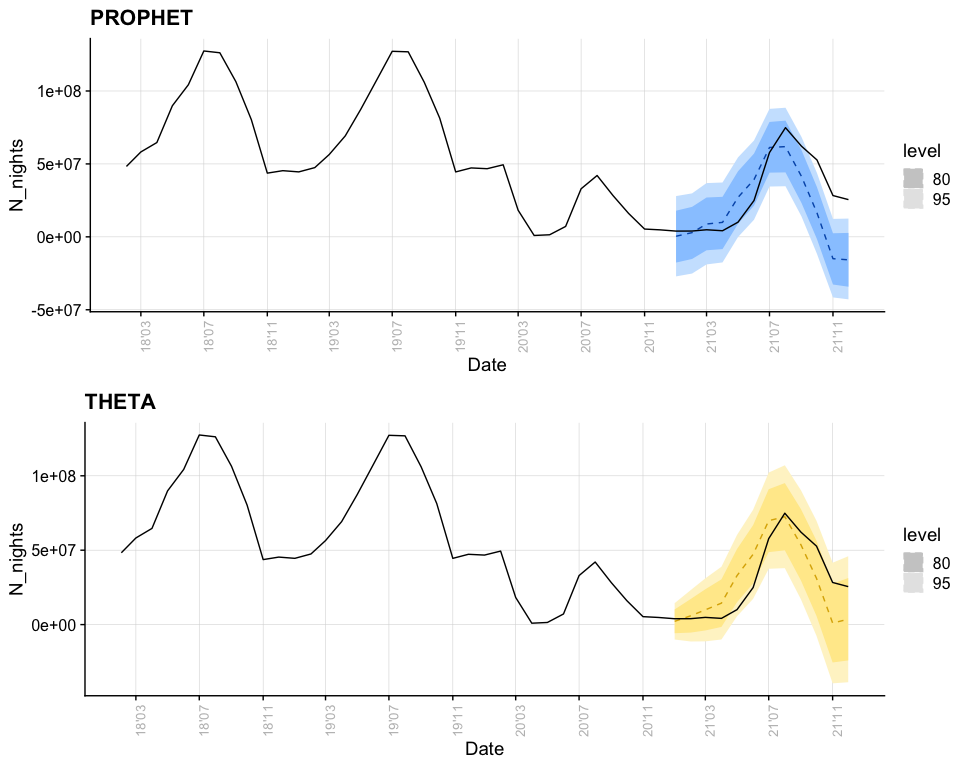

## 1 Импорт

*Возьмите любой ряд с ежемесячными наблюдениями.*

Ряд, количество ночей проведенных туристами, взяли с сайта [eurostat](https://appsso.eurostat.ec.europa.eu/nui/show.do?dataset=tour_occ_nim&lang=en), сам ряд можно скачать с [github](https://github.com/vearlen/TS1_project_2022-03/blob/main/Data/tour_occ_nim_1_Data.csv). Второй ряд, процент безработицы, тоже с сайта [eurostat](https://appsso.eurostat.ec.europa.eu/nui/show.do?dataset=une_rt_m&lang=en) и тоже можно взять копию [csv](https://github.com/vearlen/TS1_project_2022-03/blob/main/Data/ei_lmhr_m_1_Data.csv).


```r
# nights spend in hotels --------------------------------------------------
# https://appsso.eurostat.ec.europa.eu/nui/show.do?dataset=tour_occ_nim&lang=en
df2 = read.csv("Data/tour_occ_nim_1_Data.csv")

# unique(df2$NACE_R2)

df2_ts = df2 %>% 
  filter(GEO == "European Union - 27 countries (from 2020)",
         UNIT == "Number",
         C_RESID == 'Foreign country',
         UNIT == "Number",
         NACE_R2 == "Hotels and similar accommodation",
         Value != ":") %>% 
  # mutate(GEO = "EU") %>% 
  select(TIME,Value) %>%
  mutate(Value = gsub(" ","",Value)) %>% 
  mutate(Value = as.numeric(Value)) %>% 
  mutate( Date = str_replace(TIME,"M","-")) %>% 
  mutate(Date = yearmonth(Date)) %>% 
  tsibble(index=Date)  %>% 
  select(Value,Date)


# unemployment ratio ------------------------------------------------------
# https://appsso.eurostat.ec.europa.eu/nui/show.do?dataset=une_rt_m&lang=en

df3 = read.csv("Data/ei_lmhr_m_1_Data.csv")

df3_ts = df3 %>% 
  filter(INDIC == "Unemployment according to ILO definition - Total",
         S_ADJ == "Unadjusted data (i.e. neither seasonally adjusted nor calendar adjusted data)",
         Value != ":") %>% 
  select(TIME,Value) %>%
  # mutate(Value = gsub(" ","",Value)) %>% 
  mutate(Value = as.numeric(Value)) %>% 
  mutate( Date = str_replace(TIME,"M","-")) %>% 
  mutate(Date = yearmonth(Date)) %>% 
  tsibble(index=Date)  %>% 
  select(Value,Date)
```

## 2 Визуализация

*Визуализируйте сам ряд, ряд обычных и сезонных разностей, компоненты ряда, обычные и частные автокорреляционные функции.*\
Вот сам ряд.


```r
ggplot(df2_ts,aes(x=Date,y=Value))+
  geom_line(color='grey30',lty=1,size=0.4)+
  # geom_line(data=df2_ts,aes(x=Date,y=Value/1e+7),color='#0066cc',size=0.4)+
  theme_cowplot()+
  background_grid(size.major = 0.2)+
  scale_x_yearmonth(date_breaks = "6 month", date_labels = "%y'%m")+
  labs(title = "Кол-во ночей в гостинице", 
       x="",y="")+
  theme(plot.title = element_text(color='black'),
    plot.subtitle = element_text(color='grey30'),
    axis.text.x = element_text(color='grey30',size=10,angle=90),
    axis.text.y = element_text(color='grey30',size=10),
    axis.title.y = element_text(size=13))
```

<!-- -->

Можно посмотреть на два ряда вместе, потом нам это пригодится.


```r
ggplot(df3_ts,aes(x=Date,y=Value*10))+
  geom_line(color='grey30',lty=5,size=0.4)+
  geom_line(data=df2_ts,aes(x=Date,y=Value/1e+6),color='#0066cc',size=0.4)+
  theme_cowplot()+
  background_grid(size.major = 0.2)+
  scale_x_yearmonth(date_breaks = "6 month", date_labels = "%y'%m")+
  labs(title = "Кол-во ночей в гостинице", subtitle = "Безработица",
       x="",y="Безработица * 10
ночи в гостинице / 1е+06")+
  theme(plot.title = element_text(color='#0066cc'),
    plot.subtitle = element_text(color='grey30'),
    axis.text.x = element_text(color='grey30',size=10,angle=90),
    axis.text.y = element_text(color='grey30',size=10),
    axis.title.y = element_text(size=13))
```

<!-- -->

**Тут нужен комментарий.**\
Кажется у нас нет особой сезонности на pacf графике, ну по крайней мере не больше второго лага точно.


```r
gg_tsdisplay(df2_ts,plot_type = 'partial')+
  labs(title = "Ночи проведенные в гостиницах")
```

<!-- -->

STL разложение.


```r
stl_model = model(df2_ts,
                  decomp = STL(Value ~ trend(window = 30) +
                                 season(window = 50)))
components(stl_model) %>% autoplot()
```

<!-- -->

Посмотрим на разности.


```r
nights = df2_ts %>% 
  rename('N_nights'='Value')
nights = mutate(nights, diff = difference(N_nights, order_by = Date))
gg_tsdisplay(nights, y = diff, plot_type = 'partial')+
  labs(title="Разность ряда")
```

<!-- -->

В том числе сезонные. Очевидно что ковидный период подпортил статистику. Разница не выглядит стационарной.


```r
nights = mutate(nights, diff_seas = difference(N_nights, lag = 12, order_by = Date))
gg_tsdisplay(nights, y = diff_seas, plot_type = 'partial')+
  labs(title="Сезонная разность (12 месяцев)")
```

<!-- -->

Если отрезать ковидный период, то разница уже больше похожа на стационарный ряд. ARIMA (p,1,q)?


```r
nights = mutate(nights, diff_seas = difference(N_nights, lag = 12, order_by = Date))
nights_cut = filter(nights, Date < ymd("2020-03-01"))
gg_tsdisplay(nights_cut, y = diff_seas, plot_type = 'partial')+
  labs(title="Сезонная разность (12 мес) без последних двух лет")
```

<!-- -->

## 3 Стационарность

*Является ли ряд стационарным?*

### ADF с константой


```r
#3. ADF с константой
# H0: ts = ARIMA(p, 1, q) + trend (нестационарный ряд)
# Ha: ts = ARIMA(p, 0, q) + const (стационарный ряд)
summary(ur.df(nights$N_nights, type = 'drift',
                selectlags = 'AIC'))# H0 отвергается на 5% уровне значимости
```

```
## 
## ############################################### 
## # Augmented Dickey-Fuller Test Unit Root Test # 
## ############################################### 
## 
## Test regression drift 
## 
## 
## Call:
## lm(formula = z.diff ~ z.lag.1 + 1 + z.diff.lag)
## 
## Residuals:
##       Min        1Q    Median        3Q       Max 
## -35494483  -6649223  -1564895   6600159  24814553 
## 
## Coefficients:
##               Estimate Std. Error t value Pr(>|t|)    
## (Intercept)  1.257e+07  2.472e+06   5.085 1.65e-06 ***
## z.lag.1     -2.045e-01  3.529e-02  -5.795 7.52e-08 ***
## z.diff.lag   6.922e-01  7.146e-02   9.687 3.67e-16 ***
## ---
## Signif. codes:  0 '***' 0.001 '**' 0.01 '*' 0.05 '.' 0.1 ' ' 1
## 
## Residual standard error: 11940000 on 103 degrees of freedom
## Multiple R-squared:  0.5071,	Adjusted R-squared:  0.4975 
## F-statistic: 52.97 on 2 and 103 DF,  p-value: < 2.2e-16
## 
## 
## Value of test-statistic is: -5.7947 16.7916 
## 
## Critical values for test statistics: 
##       1pct  5pct 10pct
## tau2 -3.46 -2.88 -2.57
## phi1  6.52  4.63  3.81
```

```r
                                    # H0 отвергается на 1% уровне значимости
                                    # первое наблюдаемое значение -3.0 как в лекциях
                                    # сравниваем с первой строкой tau2
```

Наблюдаемое значение -5.79, критическое -2.88 (на 5% уровне значимости). Наблюдаемое меньше, т.е. Н0 отвергается - ряд стационарный.

\#\#\# KPSS c константой


```r
# KPSS с константой
# H0: ts = mu + stat (стационарный ряд)
# Ha: ts = mu + stat + rw (нестационарный ряд)
summary(ur.kpss(nights$N_nights, type = 'mu'))  # H0 не отвергается на 5% уровне значимости
```

```
## 
## ####################### 
## # KPSS Unit Root Test # 
## ####################### 
## 
## Test is of type: mu with 4 lags. 
## 
## Value of test-statistic is: 0.4021 
## 
## Critical value for a significance level of: 
##                 10pct  5pct 2.5pct  1pct
## critical values 0.347 0.463  0.574 0.739
```

```r
                                                # наблюдаемое меньше чем критическое
```

Получается что наблюдаемое значение статистики меньше чем критическое (на 5% уровне), т.е. Н0 не отвергается, значит ряд стационарный.

Подсчитаем также KPSS тест с трендом. **не уверен что это нужно**


```r
# 2. KPSS с трендом
# H0: ts = trend + stat (стационарный ряд)
# Ha: ts = trend + stat + rw (нестационарный ряд)
summary(ur.kpss(nights$N_nights, type = 'tau')) # H0 отвергается на 5% уровне значимости
```

```
## 
## ####################### 
## # KPSS Unit Root Test # 
## ####################### 
## 
## Test is of type: tau with 4 lags. 
## 
## Value of test-statistic is: 0.1712 
## 
## Critical value for a significance level of: 
##                 10pct  5pct 2.5pct  1pct
## critical values 0.119 0.146  0.176 0.216
```

```r
                                                 # наблюдаемое больше чем критическое
```

Выходит что наблюдаемое значение больше чем критическое (на 5% уровне значимости), значит H0 отвергается. Вероятно это можно объяснить тем, что у нас есть тренд.

## 4 Преобразование

*Если разумно применить к исходному ряду какое-либо преобразование, то примените его, мотивировав свой выбор.*

## 5 Деление

*Поделите ряд на тестовую и обучающую выборку.*


```r
df_all = left_join(nights,df3_ts)
df_all = rename(df_all,'unempl'='Value')
df_all = mutate(df_all, diff_unempl = difference(unempl,1),
                sdiff_unempl = difference(unempl,12))

# считаем макс мин для масштабирования
min_nights = min(df_all$diff_seas,na.rm = TRUE)
max_nights = max(df_all$diff_seas,na.rm = TRUE)
min_unmp = min(df_all$sdiff_unempl,na.rm = TRUE)
max_unmp = max(df_all$sdiff_unempl,na.rm = TRUE)

# масштабируем
df_all_sc = df_all %>% 
  mutate (nights_sdif_sc = (diff_seas-min_nights)/(max_nights-min_nights),
          unempl_sdif_sc = (sdiff_unempl-min_unmp)/(max_unmp-min_unmp))

# делим на тестовую и обучающую
df_train <- filter(df_all_sc, Date < ymd ('2021-01-01'))
df_test <- filter(df_all_sc, Date >= ymd ('2021-01-01'))
```

## 6 Модели

*Оцените ряд моделей/алгоритмов на тестовой выборке.*


```r
fit_models <- df_train %>% 
  model(
    snaive = SNAIVE(N_nights),
    arima = ARIMA(N_nights),
    ets = ETS(N_nights),
    prophet = prophet(N_nights ~ season ('year', 10, type='additive')),
    theta_decomp = decomposition_model(
                STL(N_nights ~ season(window=Inf)),
                THETA(season_adjust),
                SNAIVE(season_year))
  )
```


```r
fct = forecast(fit_models,new_data=df_test)
```


```r
fct %>% 
  accuracy(df_all) %>% 
  arrange(MAPE) %>% 
  # select(-MASE,-RMSSE) %>% 
  select(-.type) %>% 
  mutate_if(is.numeric,round,2) %>% 
  datatable(rownames = FALSE,options=list(pageLength=9), autoHideNavigation = TRUE)
```

```{=html}
<div id="htmlwidget-d5ff2927b1b9e766f973" style="width:100%;height:auto;" class="datatables html-widget"></div>
<script type="application/json" data-for="htmlwidget-d5ff2927b1b9e766f973">{"x":{"filter":"none","autoHideNavigation":true,"data":[["prophet","theta_decomp","arima","ets","snaive"],[9431521.01,744794.49,27017217.24,-15793338.43,8331459.67],[22501523.36,16013294.9,29832721.8,22567128.93,28309733.58],[16970108.87,13165861.86,27017217.24,18731603.58,25260921.33],[6.76,-37.67,171.13,-170.02,-157.86],[83.03,85.08,171.13,180.11,259.19],[1.58,1.23,2.52,1.75,2.35],[0.89,0.63,1.17,0.89,1.11],[0.81,0.8,0.69,0.77,0.74]],"container":"<table class=\"display\">\n  <thead>\n    <tr>\n      <th>.model<\/th>\n      <th>ME<\/th>\n      <th>RMSE<\/th>\n      <th>MAE<\/th>\n      <th>MPE<\/th>\n      <th>MAPE<\/th>\n      <th>MASE<\/th>\n      <th>RMSSE<\/th>\n      <th>ACF1<\/th>\n    <\/tr>\n  <\/thead>\n<\/table>","options":{"pageLength":9,"columnDefs":[{"className":"dt-right","targets":[1,2,3,4,5,6,7,8]}],"order":[],"autoWidth":false,"orderClasses":false,"lengthMenu":[9,10,25,50,100]}},"evals":[],"jsHooks":[]}</script>
```


```r
accuracy(fct,df_all) %>% 
  select(MAPE,.model) %>% 
  ggplot(aes(y=reorder(.model,-MAPE),x=MAPE,label=round(MAPE,0)))+
  geom_col(width = 0.6,alpha=0.9,color='#0057b7',fill='#ffd700')+
  geom_text(size=5,hjust = -0.5,color='#0057b7')+
  theme_cowplot()+
  scale_x_continuous(expand = expansion(mult = c(0,0.2)))+
  labs(y="Модели")
```

<!-- -->

## 7 Победитель

*Выберите наилучшую модель*

Ради лучшей визаулизации я обрезал начало ряда, но только для графика!


```r
df_all_begin_cut = filter(df_all, Date > ymd("2018-01-01"))

# prophet
plt_prophet = fct %>% 
  filter(.model == "prophet") %>% 
  autoplot(lty=2,fill='#0057b7')+
  autolayer(df_all_begin_cut)+
  theme_cowplot()+
  background_grid(size.major = 0.2)+
  scale_x_yearmonth(date_breaks = "4 month", date_labels = "%y'%m")+
  theme(axis.text.x = element_text(color='grey',size=10,angle=90))+
  labs(title = "PROPHET")

# THETA
plt_theta = fct %>% 
  filter(.model == "theta_decomp") %>% 
  autoplot(lty=2,fill='#dbaf00')+
  autolayer(df_all_begin_cut)+
  theme_cowplot()+
  background_grid(size.major = 0.2)+
  scale_x_yearmonth(date_breaks = "4 month", date_labels = "%y'%m")+
  theme(axis.text.x = element_text(color='grey',size=10,angle=90))+
  labs(title = "THETA")

plot_grid(plt_prophet,plt_theta,nrow=2)
```

<!-- -->

## 8 Удивить!


```r
ggplot(df_all,aes(x=Date,y=sdiff_unempl*100))+
  geom_line(color='grey30',lty=5,size=0.4)+
  geom_line(data=df_all,aes(x=Date,y=N_nights/1e+06),color='#0066cc',size=0.4)+
  theme_cowplot()+
  background_grid(size.major = 0.2)+
  scale_x_yearmonth(date_breaks = "6 month", date_labels = "%y'%m")+
  labs(title = "Кол-во ночей в гостинице", subtitle = "Безработица сезонный прирост (х100)",
       x="",y="Безработица прирост * 100
ночи в гостинице / 1е+06")+
  theme(plot.title = element_text(color='#0066cc'),
    plot.subtitle = element_text(color='grey30'),
    axis.text.x = element_text(color='grey30',size=10,angle=90),
    axis.text.y = element_text(color='grey30',size=10),
    axis.title.y = element_text(size=13))
```

<!-- -->


```r
fit_models_sns <- df_train %>% 
  model(
    arima_r = ARIMA(N_nights ~ unempl),
    arima_r_s = ARIMA(N_nights ~ sdiff_unempl),
    arima110_r = ARIMA(N_nights ~ unempl+ pdq(1,1,0)),
    arima110_r_s = ARIMA(N_nights ~ sdiff_unempl+ pdq(1,1,0)),
    sarima111_1xx_r = ARIMA(N_nights ~ unempl + pdq(1, 1, 1) + PDQ(1, 0:1, 0:2)),
    sarima111_1xx_r_s = ARIMA(N_nights ~ sdiff_unempl + pdq(1, 1, 1) + PDQ(1, 0:1, 0:2))
  )
```


```r
fct_sns = forecast(fit_models_sns,df_test)
```


```r
fct_sns %>% 
  accuracy(df_all) %>% 
  arrange(MAPE) %>% 
  # select(-MASE,-RMSSE) %>% 
  select(-.type) %>% 
  mutate_if(is.numeric,round,3) %>% 
  datatable(rownames = FALSE,options=list(pageLength=9), autoHideNavigation = TRUE)
```

```{=html}
<div id="htmlwidget-0ece9c3f9079674cdd17" style="width:100%;height:auto;" class="datatables html-widget"></div>
<script type="application/json" data-for="htmlwidget-0ece9c3f9079674cdd17">{"x":{"filter":"none","autoHideNavigation":true,"data":[["arima110_r","arima_r_s","arima110_r_s","sarima111_1xx_r","sarima111_1xx_r_s","arima_r"],[8816939.288,8615610.869,8615610.869,2099916.026,14477246.754,17681963.075],[16366203.001,15853896.068,15853896.068,14644554.621,19257062.138,23822474.311],[11872146.16,11790690.165,11790690.165,12259733.802,15041963.803,18930739.179],[21.624,32.14,32.14,-33.814,67.952,65.59],[49.049,55.432,55.432,74.484,82.13,97.146],[1.107,1.099,1.099,1.143,1.402,1.765],[0.644,0.624,0.624,0.576,0.758,0.937],[0.79,0.772,0.772,0.794,0.75,0.771]],"container":"<table class=\"display\">\n  <thead>\n    <tr>\n      <th>.model<\/th>\n      <th>ME<\/th>\n      <th>RMSE<\/th>\n      <th>MAE<\/th>\n      <th>MPE<\/th>\n      <th>MAPE<\/th>\n      <th>MASE<\/th>\n      <th>RMSSE<\/th>\n      <th>ACF1<\/th>\n    <\/tr>\n  <\/thead>\n<\/table>","options":{"pageLength":9,"columnDefs":[{"className":"dt-right","targets":[1,2,3,4,5,6,7,8]}],"order":[],"autoWidth":false,"orderClasses":false,"lengthMenu":[9,10,25,50,100]}},"evals":[],"jsHooks":[]}</script>
```


```r
report(fit_models_sns$arima_r_s[[1]]) # авто с десезон безработицей
```

```
## Series: N_nights 
## Model: LM w/ ARIMA(1,1,0)(0,1,1)[12] errors 
## 
## Coefficients:
##          ar1     sma1  sdiff_unempl
##       0.4315  -0.6506      -4365068
## s.e.  0.1114   0.2152       4113844
## 
## sigma^2 estimated as 4.098e+13:  log likelihood=-1221.09
## AIC=2450.18   AICc=2450.69   BIC=2459.85
```


```r
report(fit_models_sns$arima110_r[[1]]) # полу-авто
```

```
## Series: N_nights 
## Model: LM w/ ARIMA(1,1,0)(0,1,1)[12] errors 
## 
## Coefficients:
##          ar1     sma1    unempl
##       0.3898  -0.6795  -7838025
## s.e.  0.1053   0.1817   4717076
## 
## sigma^2 estimated as 4.188e+13:  log likelihood=-1421.71
## AIC=2851.41   AICc=2851.93   BIC=2861.09
```

### Средняя модель


```r
av_model <- fit_models_sns %>% 
  mutate(mean = (arima110_r + arima_r_s)/2)
```


```r
fct_w_av = forecast(av_model,new_data = df_test)
```


```r
fct_w_av %>% 
  accuracy(df_all) %>% 
  arrange(MAPE) %>% 
  select(-.type) %>% 
  mutate_if(is.numeric,round,2) %>% 
  datatable(rownames = FALSE,options=list(pageLength=10), autoHideNavigation = TRUE)
```

```{=html}
<div id="htmlwidget-1ec37efa773baaf08313" style="width:100%;height:auto;" class="datatables html-widget"></div>
<script type="application/json" data-for="htmlwidget-1ec37efa773baaf08313">{"x":{"filter":"none","autoHideNavigation":true,"data":[["arima110_r","mean","arima_r_s","arima110_r_s","sarima111_1xx_r","sarima111_1xx_r_s","arima_r"],[8816939.29,8716275.08,8615610.87,8615610.87,2099916.03,14477246.75,17681963.07],[16366203,16090401.27,15853896.07,15853896.07,14644554.62,19257062.14,23822474.31],[11872146.16,11831418.16,11790690.16,11790690.16,12259733.8,15041963.8,18930739.18],[21.62,26.88,32.14,32.14,-33.81,67.95,65.59],[49.05,52.24,55.43,55.43,74.48,82.13,97.15],[1.11,1.1,1.1,1.1,1.14,1.4,1.76],[0.64,0.63,0.62,0.62,0.58,0.76,0.94],[0.79,0.78,0.77,0.77,0.79,0.75,0.77]],"container":"<table class=\"display\">\n  <thead>\n    <tr>\n      <th>.model<\/th>\n      <th>ME<\/th>\n      <th>RMSE<\/th>\n      <th>MAE<\/th>\n      <th>MPE<\/th>\n      <th>MAPE<\/th>\n      <th>MASE<\/th>\n      <th>RMSSE<\/th>\n      <th>ACF1<\/th>\n    <\/tr>\n  <\/thead>\n<\/table>","options":{"pageLength":10,"columnDefs":[{"className":"dt-right","targets":[1,2,3,4,5,6,7,8]}],"order":[],"autoWidth":false,"orderClasses":false}},"evals":[],"jsHooks":[]}</script>
```

Все равно ARIMA c регрессией осталась лучшей.


```r
accuracy(fct_w_av,df_all) %>% 
  select(MAPE,.model) %>% 
  ggplot(aes(y=reorder(.model,-MAPE),x=MAPE,label=round(MAPE,0)))+
  geom_col(width = 0.6,alpha=0.9,color='#0057b7',fill='#ffd700')+
  geom_text(size=5,hjust = -0.5,color='#0057b7')+
  theme_cowplot()+
  scale_x_continuous(expand = expansion(mult = c(0,0.2)))+
  labs(y="Модели")
```

<!-- -->


```r
# ARIMA
plt_arima110_r = fct_w_av %>% 
  filter(.model == "arima110_r") %>% 
  autoplot(lty=2,fill='#dbaf00')+
  autolayer(df_all_begin_cut)+
  theme_cowplot()+
  background_grid(size.major = 0.2)+
  scale_x_yearmonth(date_breaks = "4 month", date_labels = "%y'%m")+
  theme(axis.text.x = element_text(color='grey',size=10,angle=90))+
  labs(title = "ARIMA ~ unemployment (110)(011)  ")

plot_grid(plt_arima110_r,plt_prophet,nrow=2)
```

<!-- -->

Еще можно предсказать в будущее.


```r
# 
fit_full <- model(df_all,
  ARIMA(N_nights ~ unemp + pdq(1,1,0) + PDQ (0,1,1)))
```


```r
# НУЖЕН ПРОГНОЗ БЕЗРАБОТИЦЫ
fct_future = forecast(fit_full,h=24)
```


```r
fct_future %>% 
  autoplot(color="#0066cc",alpha=0.7)+
  autolayer(df_all_begin_cut)+
  scale_x_yearmonth(date_breaks = "4 month", date_labels = "%y'%m")+
  theme_cowplot()+
  background_grid()+
   theme(axis.text.x = element_text(color='grey',size=10,angle=90))+
  labs(title="Предсказание в будущее",
       subtitle = "ARIMA")
```

<!-- -->

## 9 Случай из жизни
